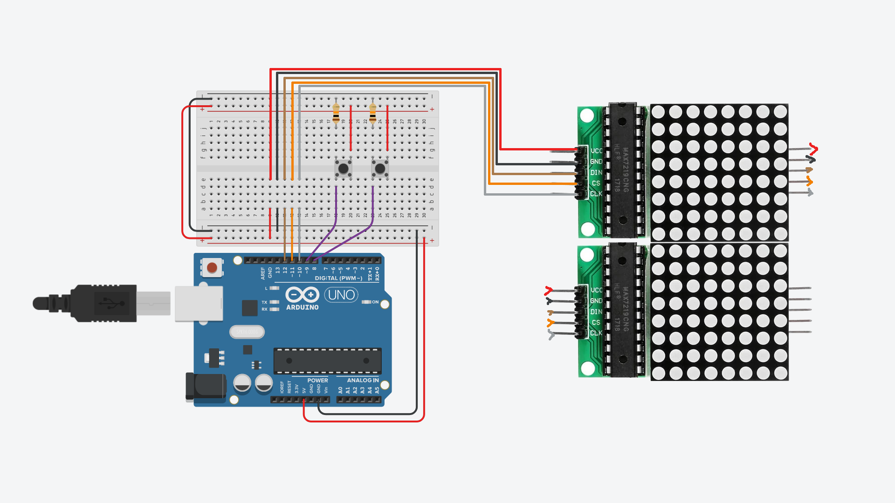

# Tetris in C, WASM and Arduino

Simple clone of the tetris game in C (then in Web (and even then for Arduino)).

The main challenge of this project is trying to make the game as memory
efficient as possible. The game has a 12x8 board which is stored in only 12
bytes using a `char[12]`. Also all the pieces are stored as `int`. The goal of
the project is to learn bitwise operations and understand the memory layout.

## Quickstart CLI

Use `a-d` to move and `q` to quit. No rotation or fast move supported.

```console
make cli
./dist/cli
```

## Quickstart WEB

Use `a-d` (or Key Arrows) to move.

```console
make web
python -m http.server 6969 -d dist/
# open the browser at localhost:6969
```

## Quickstart Arduino

Assemble the parts as shown in the schematic and then connect the Arduino to
the USB. You will need some dependencies installed and to have Arduino on
/dev/ttyACM0, but other than that it should all be good to go.



```console
make atmega.build
sudo make atmega.copy
# play with the tetris game
```
